# 시퀀스 다이어그램

> API별 요청/응답 흐름을 시각화한 시퀀스 다이어그램

## 목차

- [회원 (Member)](#회원-member)
- [포인트 (Point)](#포인트-point)
- [상품 (Product)](#상품-product)
- [브랜드 (Brand)](#브랜드-brand)
- [좋아요 (Like)](#좋아요-like)
- [주문 (Order)](#주문-order)

---

## 회원 (Member)

### 회원가입

`POST /api/v1/users`

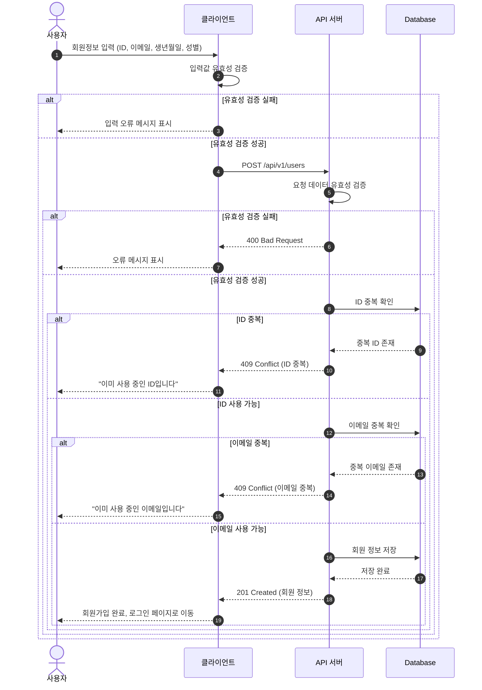

---

### 내 정보 조회

`GET /api/v1/users/me`

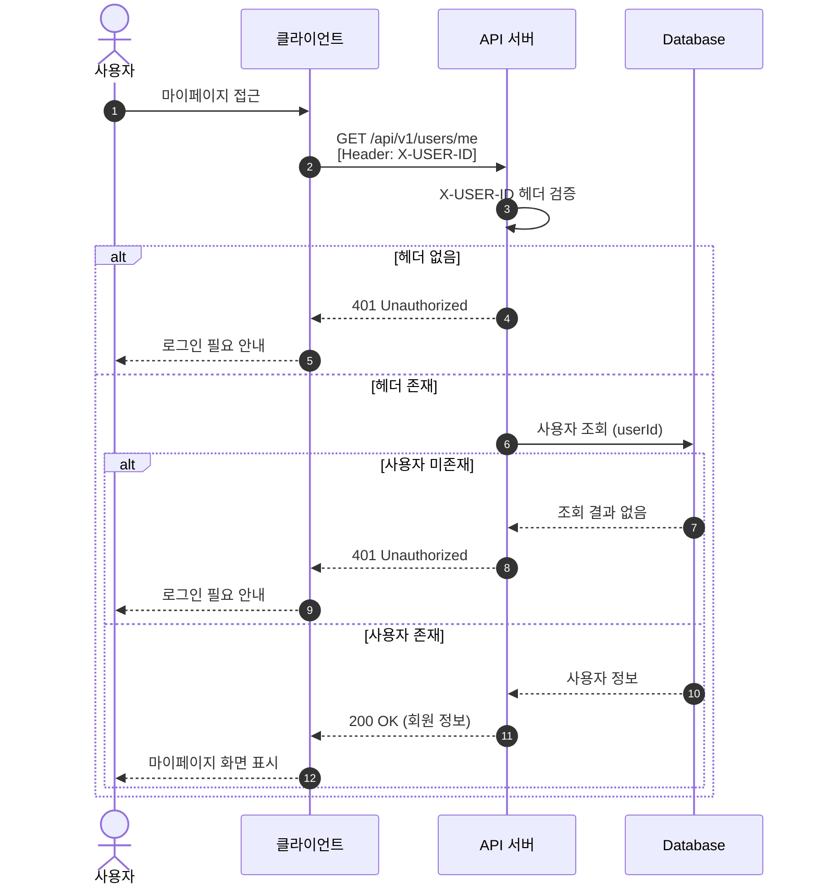

---

## 포인트 (Point)

### 포인트 충전

`POST /api/v1/points/charge`

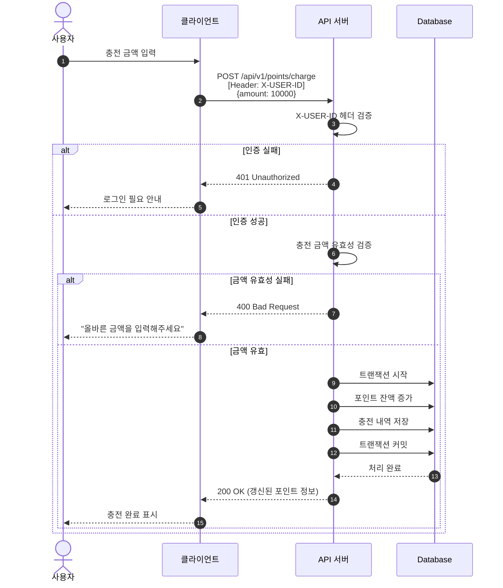

---

### 포인트 조회

`GET /api/v1/points`

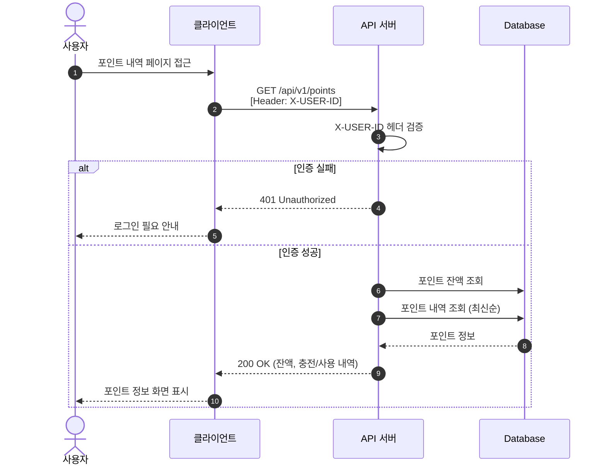

---

## 상품 (Product)

### 상품 목록 조회

`GET /api/v1/products`

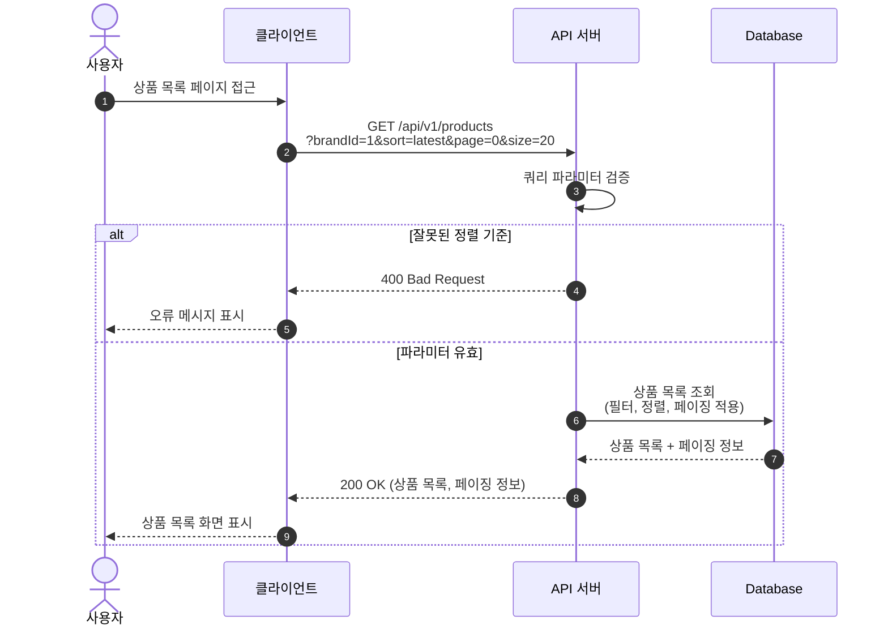

---

### 상품 상세 조회

`GET /api/v1/products/{productId}`

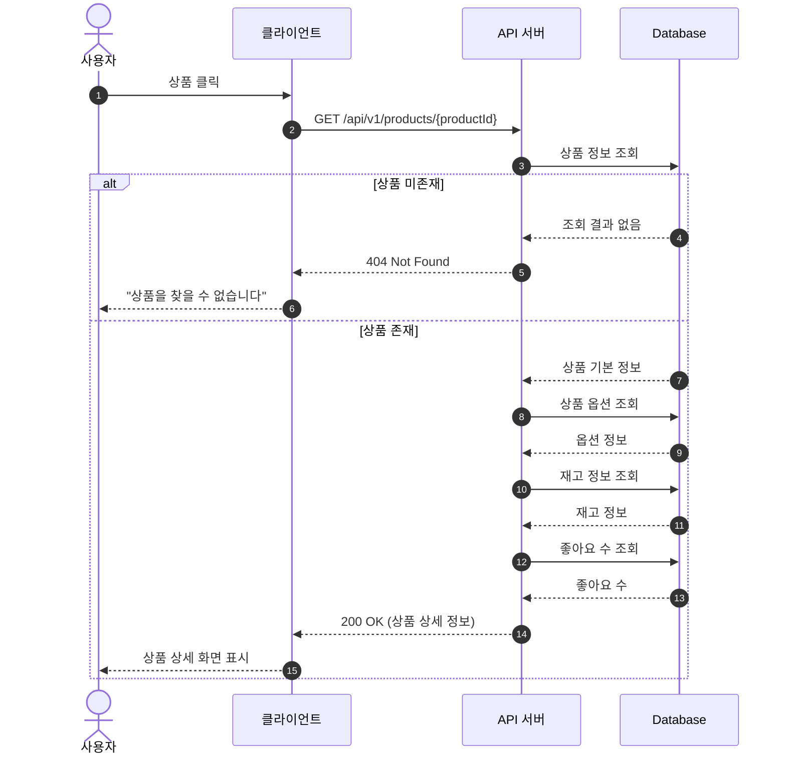

---

## 브랜드 (Brand)

### 브랜드 상세 조회

`GET /api/v1/brands/{brandId}`

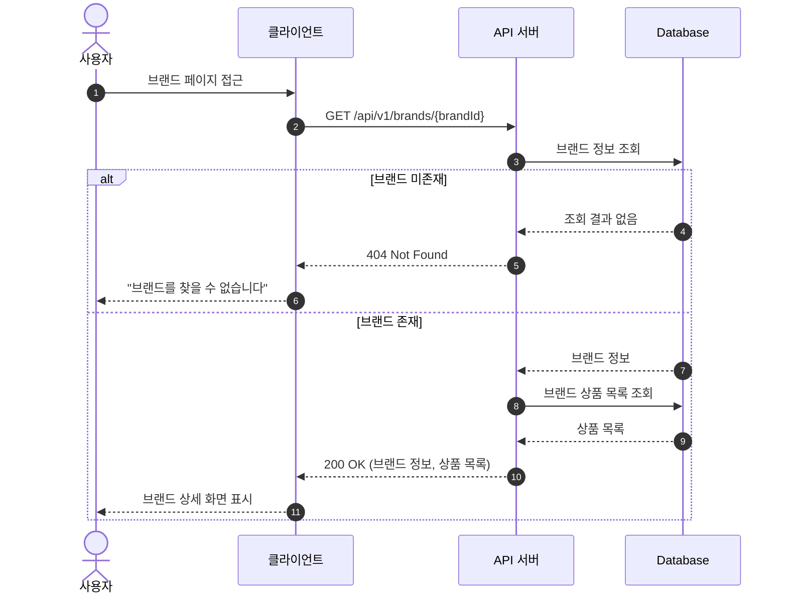

---

## 좋아요 (Like)

### 좋아요 등록

`POST /api/v1/like/products/{productId}`

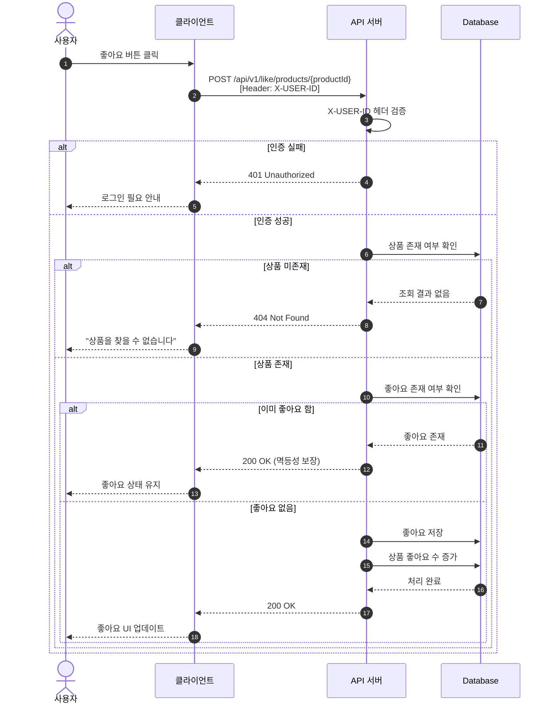

---

### 좋아요 취소

`DELETE /api/v1/like/products/{productId}`

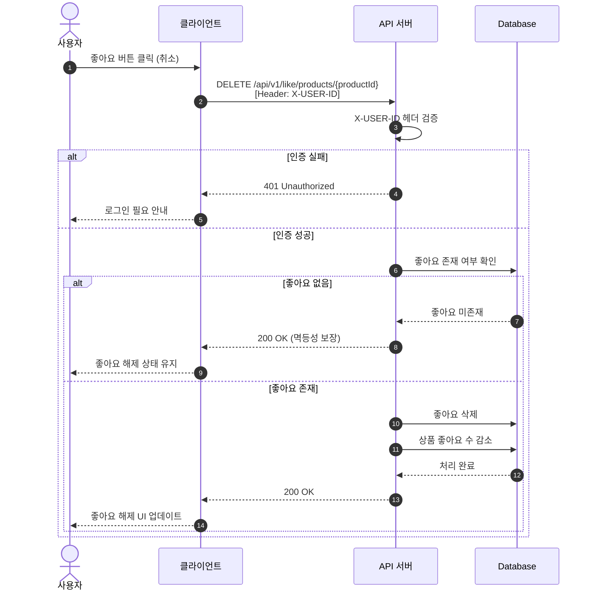

---

### 좋아요 목록 조회

`GET /api/v1/like/products`

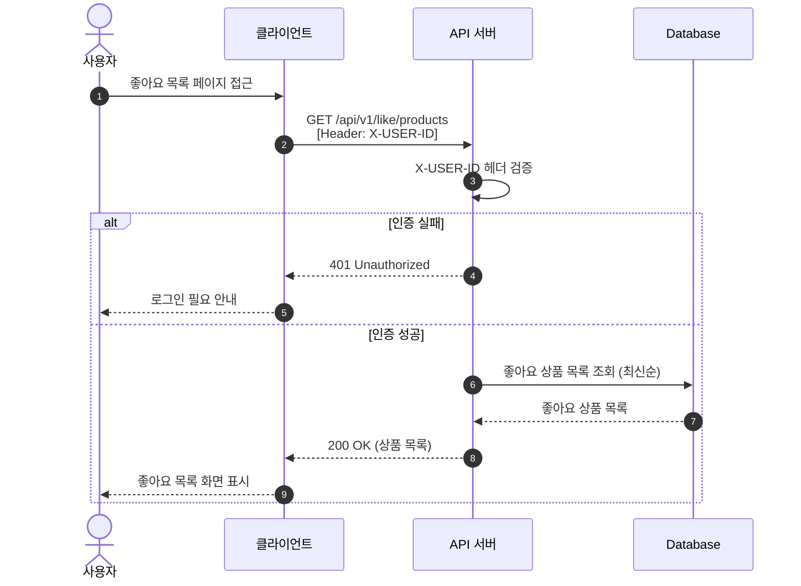

---

## 주문 (Order)

### 주문 생성

`POST /api/v1/orders`

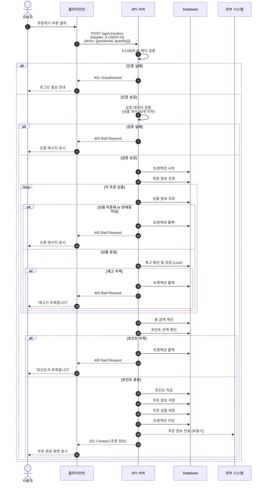

---

### 주문 목록 조회

`GET /api/v1/orders`

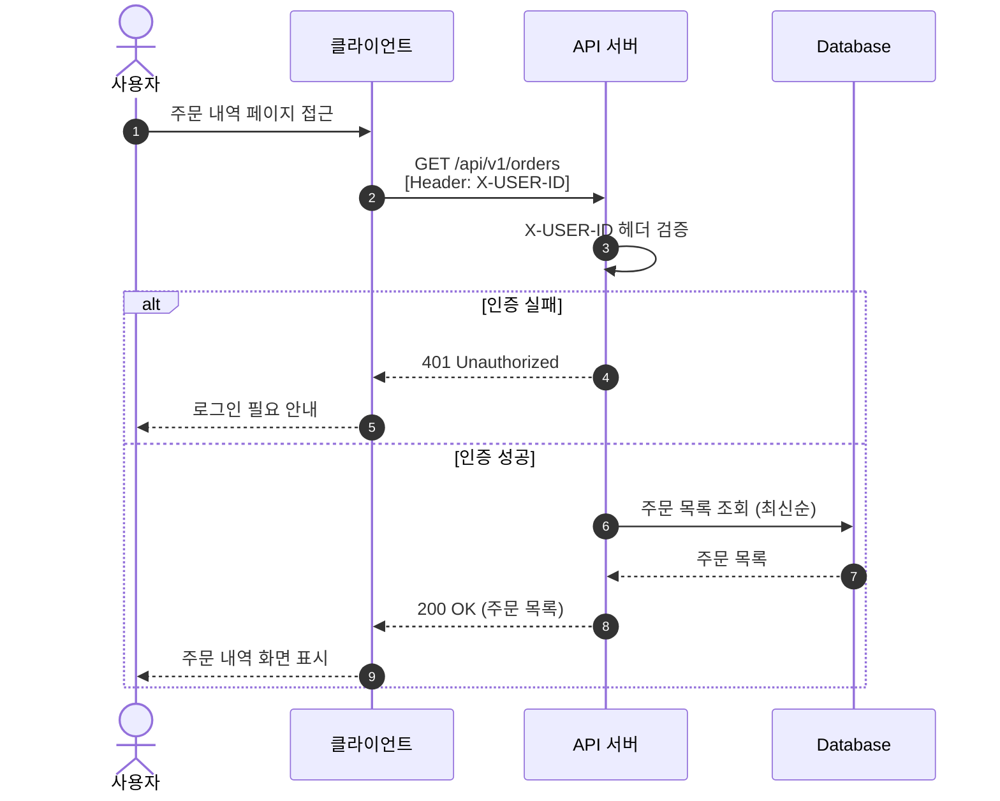

---

### 주문 상세 조회

`GET /api/v1/orders/{orderId}`

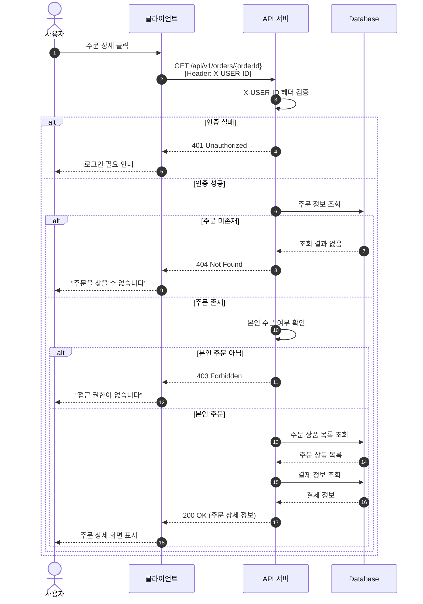
