# 시퀀스 다이어그램

> `apps/commerce-api` 현재 코드 기준 상세 흐름

## 목차

- [회원 (User)](#회원-user)
- [포인트 (Point)](#포인트-point)
- [상품 (Product)](#상품-product)
- [브랜드 (Brand)](#브랜드-brand)
- [좋아요 (Like)](#좋아요-like)
- [주문/쿠폰 (Order/Coupon)](#주문쿠폰-ordercoupon)
- [결제 (Payment)](#결제-payment)
- [랭킹 (Ranking)](#랭킹-ranking)

---

## 회원 (User)

### 회원가입

`POST /api/v1/users`

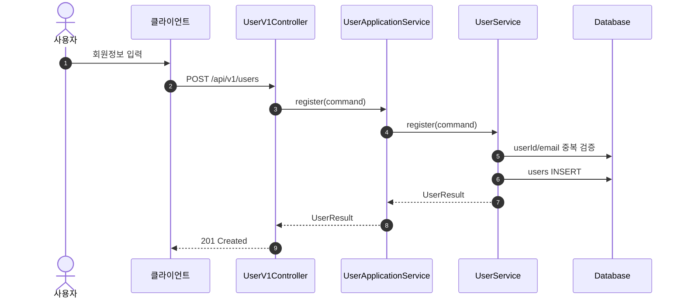

### 내 정보 조회

`GET /api/v1/users/me`

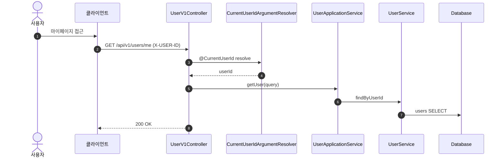

---

## 포인트 (Point)

### 포인트 충전

`POST /api/v1/points/charge`

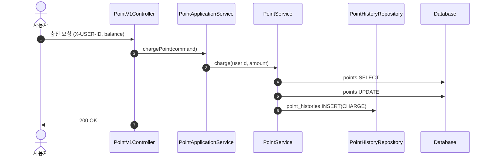

### 포인트 조회

`GET /api/v1/points`

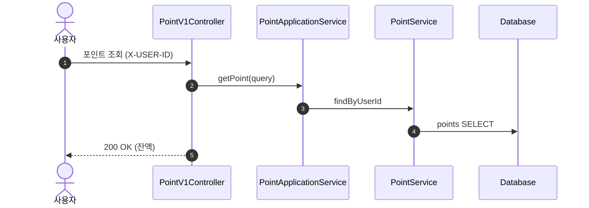

---

## 상품 (Product)

### 상품 목록 조회

`GET /api/v1/products`

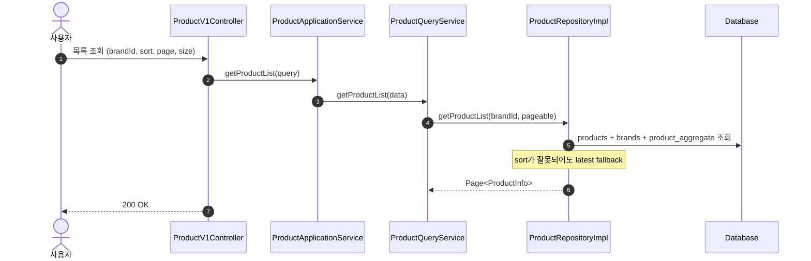

### 상품 상세 조회 + 조회수 이벤트

`GET /api/v1/products/{productId}`

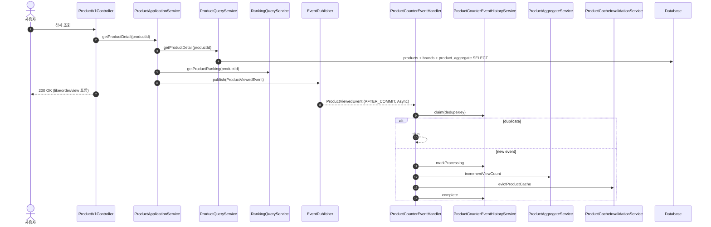

---

## 브랜드 (Brand)

### 브랜드 상세 조회

`GET /api/v1/brands/{brandId}`

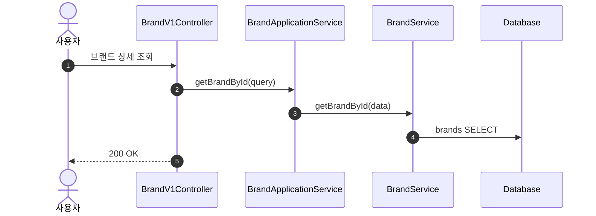

---

## 좋아요 (Like)

### 좋아요 등록

`POST /api/v1/like/products/{productId}`

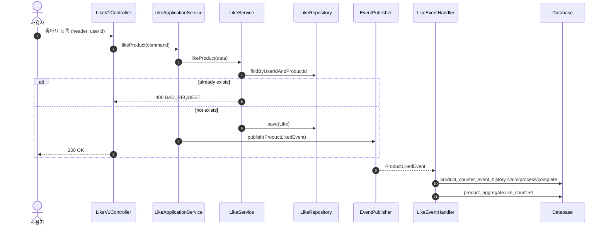

### 좋아요 취소

`DELETE /api/v1/like/products/{productId}`

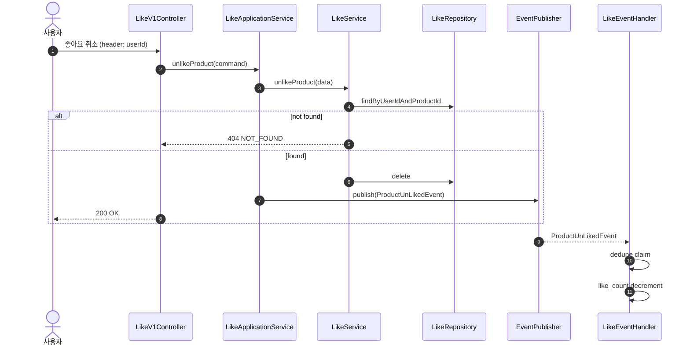

---

## 주문/쿠폰 (Order/Coupon)

### 주문 생성 (동기 처리 + 멱등성 + outbox)

`POST /api/v1/orders`

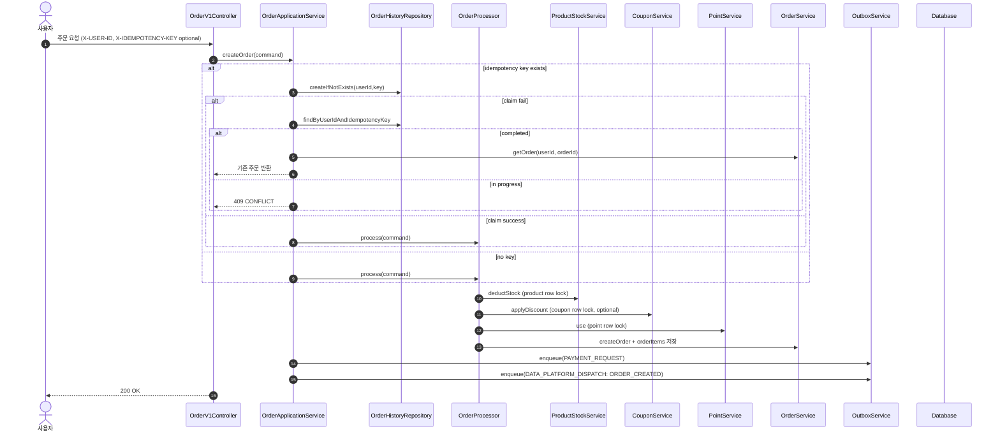

### Outbox 디스패치

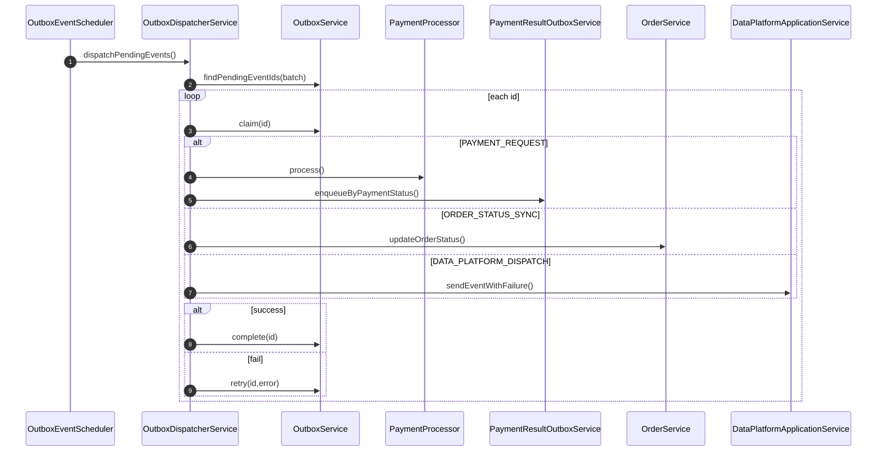

---

## 결제 (Payment)

### 주문 생성 이벤트 기반 결제 요청

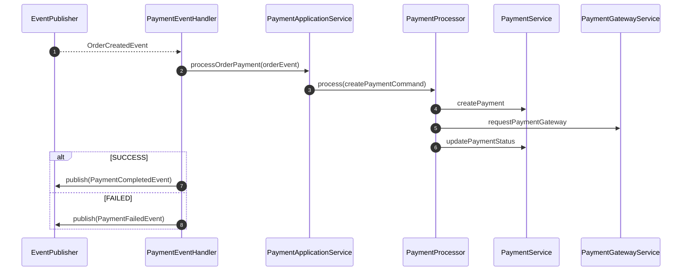

### 결제 콜백 접수/비동기 처리

`POST /api/v1/payments/callback`

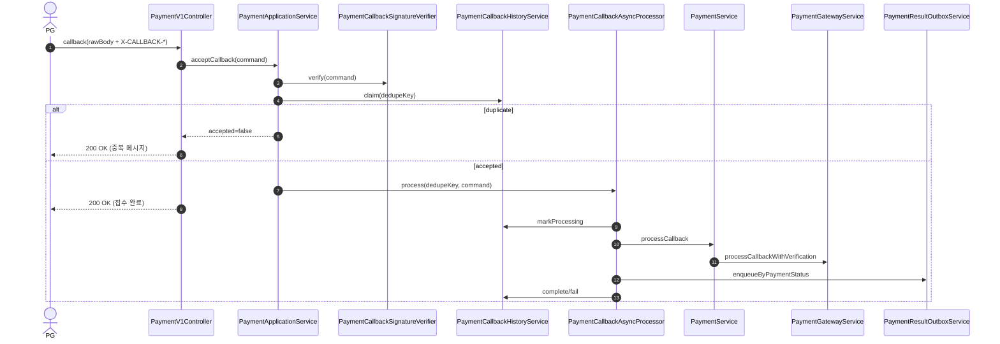

### 결제 상태 재검증 스케줄러

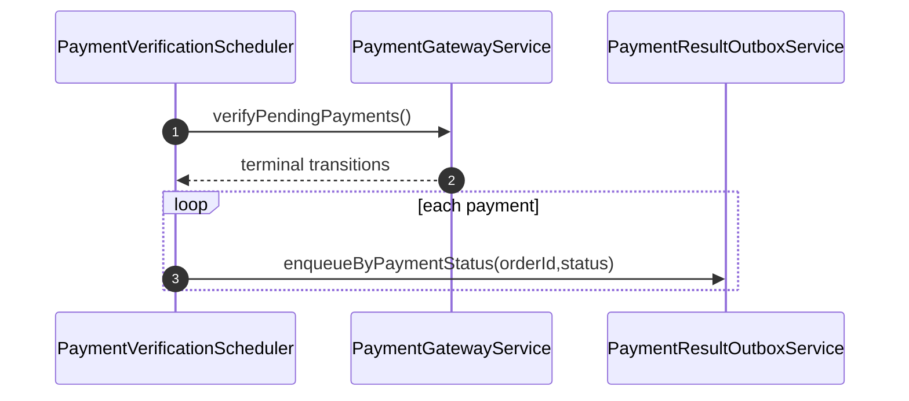

---

## 랭킹 (Ranking)

### 랭킹 조회

`GET /api/v1/rankings`

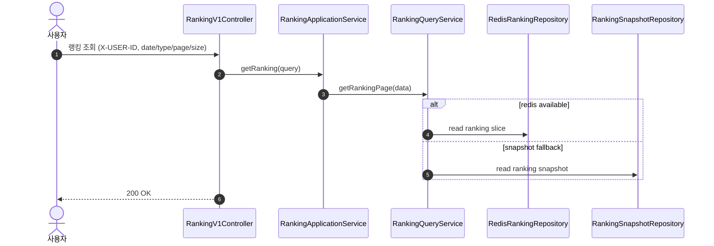
