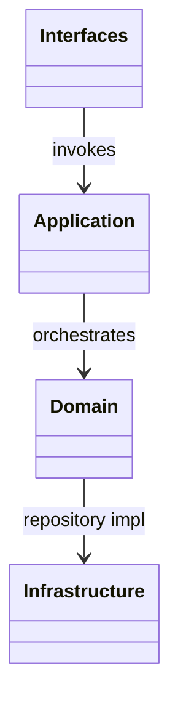
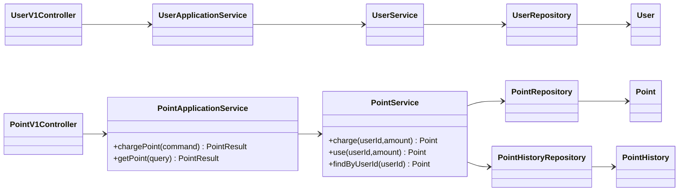
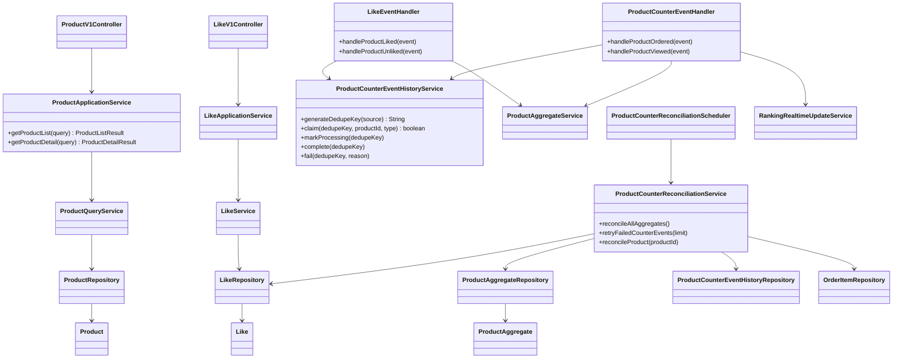
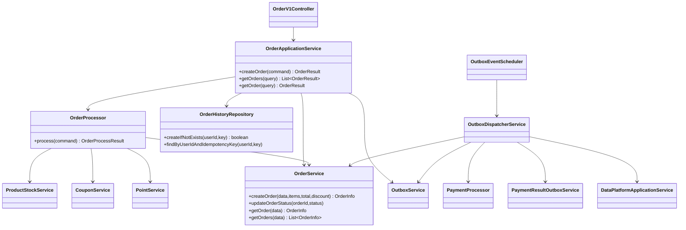
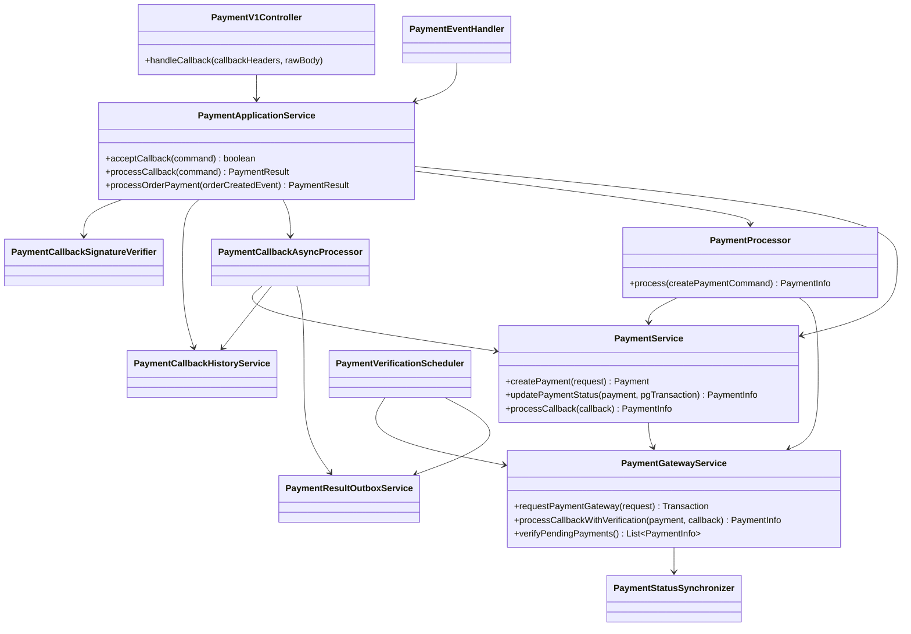
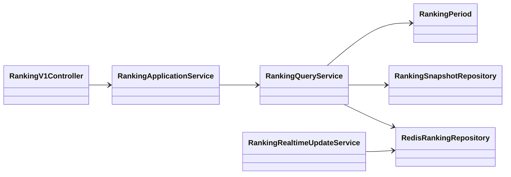

# 클래스 다이어그램

> `apps/commerce-api` 현재 코드 기준 상세 클래스 구조

## 목차

- [전체 레이어 구조](#전체-레이어-구조)
- [회원/포인트](#회원포인트)
- [상품/좋아요/집계](#상품좋아요집계)
- [주문/아웃박스](#주문아웃박스)
- [결제/콜백](#결제콜백)
- [랭킹](#랭킹)

---

## 전체 레이어 구조

---

## 회원/포인트

---

## 상품/좋아요/집계

---

## 주문/아웃박스

---

## 결제/콜백

---

## 랭킹

---

## 동시성/멱등성 제어 포인트

- 주문 경로 행락: `products`, `coupons`, `points`는 `PESSIMISTIC_WRITE` 기반 접근
- 엔티티 버전: `Product`, `Coupon`, `Like`, `Payment`
- 주문 멱등성: `order_history(user_id, idempotency_key)` 유니크 + claim 패턴
- 콜백 멱등성: `payment_callback_history.dedupe_key` 유니크
- 카운터 멱등성: `product_counter_event_history.dedupe_key` 유니크
- 아웃박스 멱등성: `event_outbox.dedupe_key` 유니크
