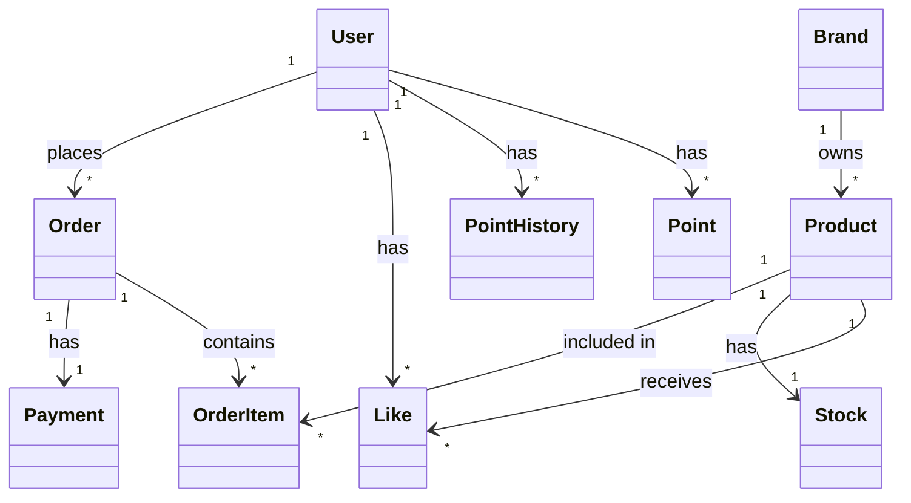
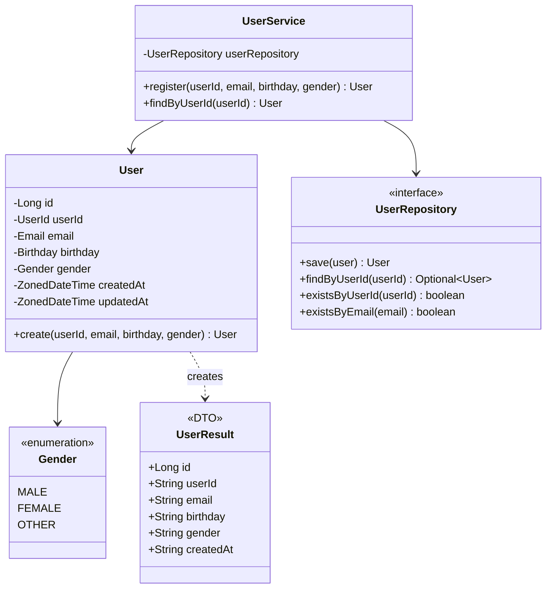
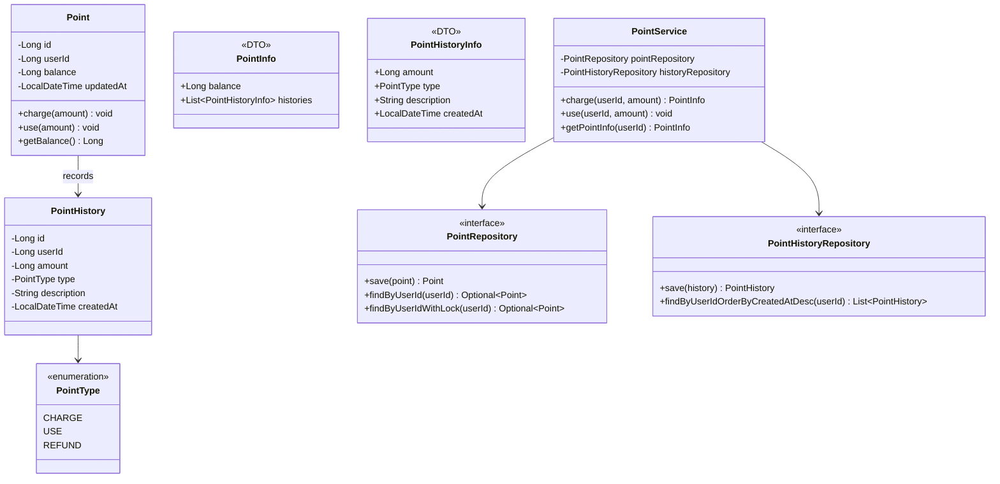
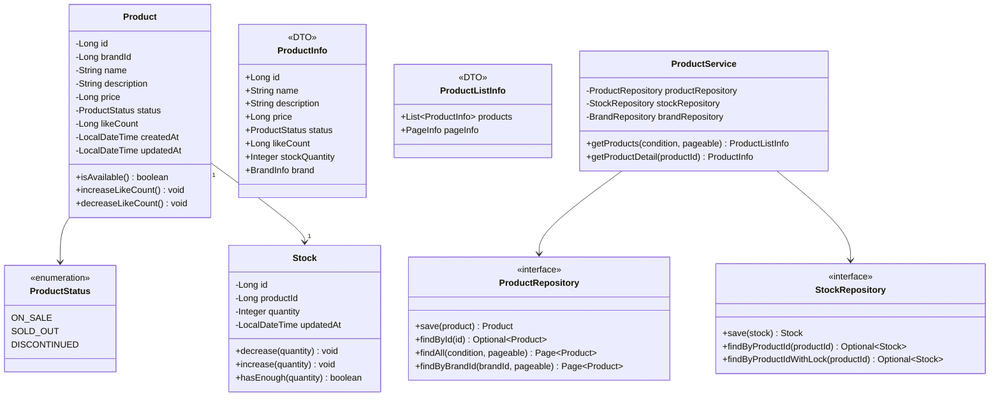
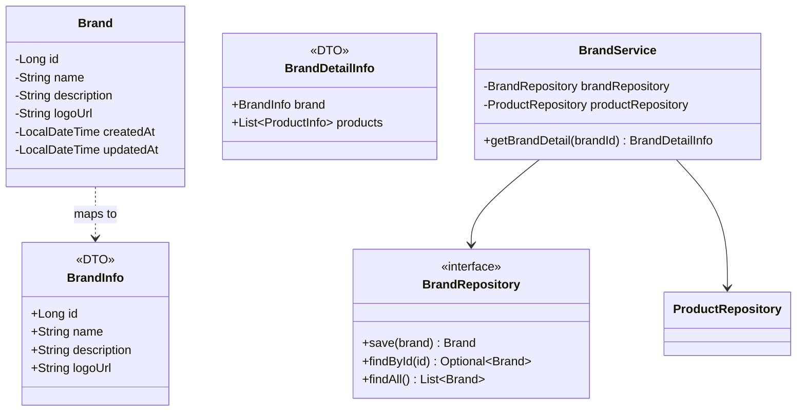
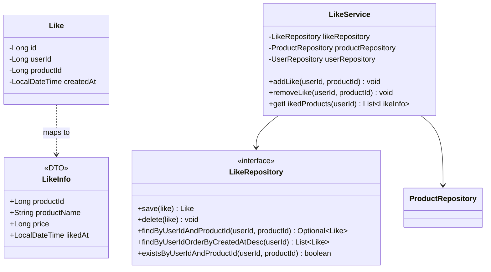
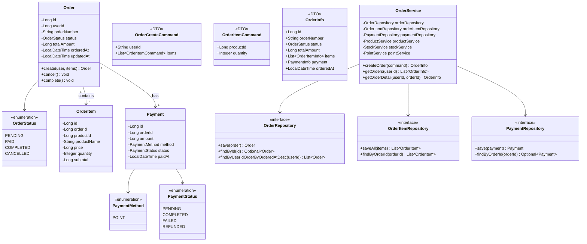
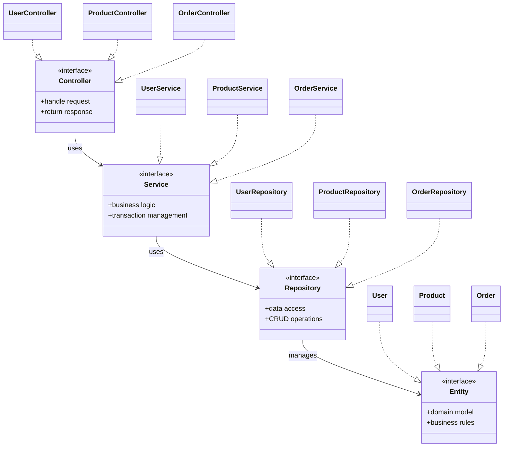

# 클래스 다이어그램

> 도메인별 클래스 구조 및 관계

## 목차

- [전체 도메인 구조](#전체-도메인-구조)
- [회원 (User)](#회원-user)
- [포인트 (Point)](#포인트-point)
- [상품 (Product)](#상품-product)
- [브랜드 (Brand)](#브랜드-brand)
- [좋아요 (Like)](#좋아요-like)
- [주문 (Order)](#주문-order)

---

## 전체 도메인 구조

---

## 회원 (User)

---

## 포인트 (Point)

---

## 상품 (Product)

---

## 브랜드 (Brand)

---

## 좋아요 (Like)

---

## 주문 (Order)

---

## 레이어드 아키텍처

