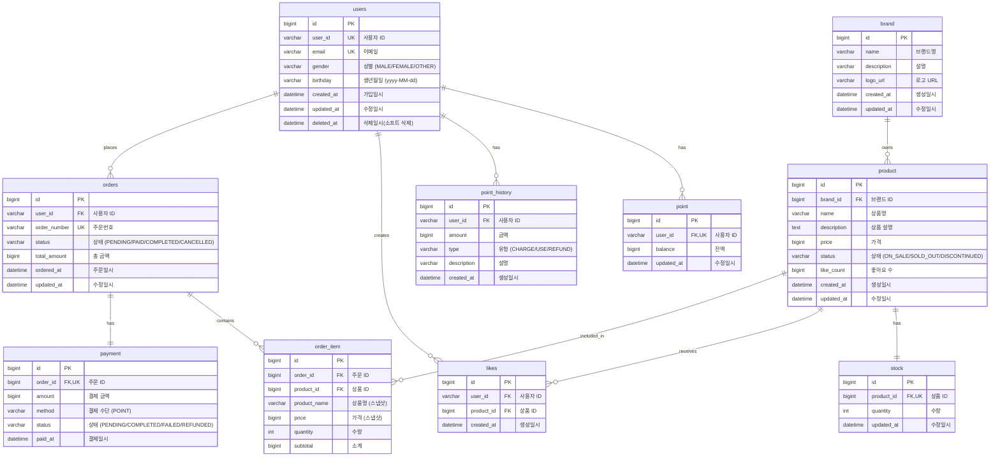

# ERD (Entity Relationship Diagram)

> 데이터베이스 테이블 구조 및 관계

## 목차

- [전체 ERD](#전체-erd)
- [테이블 상세](#테이블-상세)
  - [users](#users)
  - [point](#point)
  - [point_history](#point_history)
  - [brand](#brand)
  - [product](#product)
  - [stock](#stock)
  - [likes](#likes)
  - [orders](#orders)
  - [order_item](#order_item)
  - [payment](#payment)

---

## 전체 ERD



---

## 테이블 상세

### users

> 회원 정보 테이블

| 컬럼명 | 타입 | 제약조건 | 설명 |
|--------|------|----------|------|
| id | BIGINT | PK, AUTO_INCREMENT | 기본키 |
| user_id | VARCHAR(20) | UK, NOT NULL | 사용자 ID |
| email | VARCHAR(255) | UK, NOT NULL | 이메일 |
| gender | VARCHAR(20) | NOT NULL | 성별 (MALE/FEMALE/OTHER) |
| birthday | VARCHAR(10) | NOT NULL | 생년월일 (`yyyy-MM-dd`) |
| created_at | DATETIME(6) | NOT NULL | 가입일시 |
| updated_at | DATETIME(6) | NOT NULL | 수정일시 |
| deleted_at | DATETIME(6) | NULL | 삭제일시(소프트 삭제) |

**인덱스**
- `uk_users_user_id` (UNIQUE): user_id
- `uk_users_email` (UNIQUE): email

---

### point

> 포인트 잔액 테이블

| 컬럼명 | 타입 | 제약조건 | 설명 |
|--------|------|----------|------|
| id | BIGINT | PK, AUTO_INCREMENT | 기본키 |
| user_id | VARCHAR(20) | FK, UK, NOT NULL | 사용자 ID |
| balance | BIGINT | NOT NULL, DEFAULT 0 | 잔액 |
| updated_at | DATETIME | NOT NULL | 수정일시 |

**인덱스**
- `uk_point_user_id` (UNIQUE): user_id

**외래키**
- `fk_point_user`: user_id → users(user_id)

---

### point_history

> 포인트 이력 테이블

| 컬럼명 | 타입 | 제약조건 | 설명 |
|--------|------|----------|------|
| id | BIGINT | PK, AUTO_INCREMENT | 기본키 |
| user_id | VARCHAR(20) | FK, NOT NULL | 사용자 ID |
| amount | BIGINT | NOT NULL | 금액 |
| type | VARCHAR(20) | NOT NULL | 유형 (CHARGE/USE/REFUND) |
| description | VARCHAR(200) | | 설명 |
| created_at | DATETIME | NOT NULL | 생성일시 |

**인덱스**
- `idx_point_history_user_id_created_at`: (user_id, created_at DESC)

**외래키**
- `fk_point_history_user`: user_id → users(user_id)

---

### brand

> 브랜드 정보 테이블

| 컬럼명 | 타입 | 제약조건 | 설명 |
|--------|------|----------|------|
| id | BIGINT | PK, AUTO_INCREMENT | 기본키 |
| name | VARCHAR(100) | NOT NULL | 브랜드명 |
| description | VARCHAR(500) | | 설명 |
| logo_url | VARCHAR(500) | | 로고 URL |
| created_at | DATETIME | NOT NULL | 생성일시 |
| updated_at | DATETIME | NOT NULL | 수정일시 |

---

### product

> 상품 정보 테이블

| 컬럼명 | 타입 | 제약조건 | 설명 |
|--------|------|----------|------|
| id | BIGINT | PK, AUTO_INCREMENT | 기본키 |
| brand_id | BIGINT | FK, NOT NULL | 브랜드 ID |
| name | VARCHAR(200) | NOT NULL | 상품명 |
| description | TEXT | | 상품 설명 |
| price | BIGINT | NOT NULL | 가격 |
| status | VARCHAR(20) | NOT NULL, DEFAULT 'ON_SALE' | 상태 |
| like_count | BIGINT | NOT NULL, DEFAULT 0 | 좋아요 수 |
| created_at | DATETIME | NOT NULL | 생성일시 |
| updated_at | DATETIME | NOT NULL | 수정일시 |

**인덱스**
- `idx_product_brand_id`: brand_id
- `idx_product_status`: status
- `idx_product_created_at`: created_at DESC
- `idx_product_like_count`: like_count DESC

**외래키**
- `fk_product_brand`: brand_id → brand(id)

---

### stock

> 재고 정보 테이블

| 컬럼명 | 타입 | 제약조건 | 설명 |
|--------|------|----------|------|
| id | BIGINT | PK, AUTO_INCREMENT | 기본키 |
| product_id | BIGINT | FK, UK, NOT NULL | 상품 ID |
| quantity | INT | NOT NULL, DEFAULT 0 | 수량 |
| updated_at | DATETIME | NOT NULL | 수정일시 |

**인덱스**
- `uk_stock_product_id` (UNIQUE): product_id

**외래키**
- `fk_stock_product`: product_id → product(id)

---

### likes

> 좋아요 테이블

| 컬럼명 | 타입 | 제약조건 | 설명 |
|--------|------|----------|------|
| id | BIGINT | PK, AUTO_INCREMENT | 기본키 |
| user_id | VARCHAR(20) | FK, NOT NULL | 사용자 ID |
| product_id | BIGINT | FK, NOT NULL | 상품 ID |
| created_at | DATETIME | NOT NULL | 생성일시 |

**인덱스**
- `uk_likes_user_product` (UNIQUE): (user_id, product_id)
- `idx_likes_user_id_created_at`: (user_id, created_at DESC)
- `idx_likes_product_id`: product_id

**외래키**
- `fk_likes_user`: user_id → users(user_id)
- `fk_likes_product`: product_id → product(id)

---

### orders

> 주문 테이블

| 컬럼명 | 타입 | 제약조건 | 설명 |
|--------|------|----------|------|
| id | BIGINT | PK, AUTO_INCREMENT | 기본키 |
| user_id | VARCHAR(20) | FK, NOT NULL | 사용자 ID |
| order_number | VARCHAR(50) | UK, NOT NULL | 주문번호 |
| status | VARCHAR(20) | NOT NULL, DEFAULT 'PENDING' | 상태 |
| total_amount | BIGINT | NOT NULL | 총 금액 |
| ordered_at | DATETIME | NOT NULL | 주문일시 |
| updated_at | DATETIME | NOT NULL | 수정일시 |

**인덱스**
- `uk_orders_order_number` (UNIQUE): order_number
- `idx_orders_user_id_ordered_at`: (user_id, ordered_at DESC)
- `idx_orders_status`: status

**외래키**
- `fk_orders_user`: user_id → users(user_id)

---

### order_item

> 주문 상품 테이블

| 컬럼명 | 타입 | 제약조건 | 설명 |
|--------|------|----------|------|
| id | BIGINT | PK, AUTO_INCREMENT | 기본키 |
| order_id | BIGINT | FK, NOT NULL | 주문 ID |
| product_id | BIGINT | FK, NOT NULL | 상품 ID |
| product_name | VARCHAR(200) | NOT NULL | 상품명 (스냅샷) |
| price | BIGINT | NOT NULL | 가격 (스냅샷) |
| quantity | INT | NOT NULL | 수량 |
| subtotal | BIGINT | NOT NULL | 소계 |

**인덱스**
- `idx_order_item_order_id`: order_id

**외래키**
- `fk_order_item_order`: order_id → orders(id)
- `fk_order_item_product`: product_id → product(id)

---

### payment

> 결제 정보 테이블

| 컬럼명 | 타입 | 제약조건 | 설명 |
|--------|------|----------|------|
| id | BIGINT | PK, AUTO_INCREMENT | 기본키 |
| order_id | BIGINT | FK, UK, NOT NULL | 주문 ID |
| amount | BIGINT | NOT NULL | 결제 금액 |
| method | VARCHAR(20) | NOT NULL | 결제 수단 (POINT) |
| status | VARCHAR(20) | NOT NULL, DEFAULT 'PENDING' | 상태 |
| paid_at | DATETIME | | 결제일시 |

**인덱스**
- `uk_payment_order_id` (UNIQUE): order_id

**외래키**
- `fk_payment_order`: order_id → orders(id)

---

## DDL 스크립트

```sql
-- users
CREATE TABLE users (
    id BIGINT AUTO_INCREMENT PRIMARY KEY,
    user_id VARCHAR(20) NOT NULL,
    email VARCHAR(255) NOT NULL,
    birthday VARCHAR(10) NOT NULL,
    gender VARCHAR(20) NOT NULL,
    created_at DATETIME(6) NOT NULL,
    updated_at DATETIME(6) NOT NULL,
    deleted_at DATETIME(6) NULL,
    UNIQUE KEY uk_users_user_id (user_id),
    UNIQUE KEY uk_users_email (email)
) ENGINE=InnoDB DEFAULT CHARSET=utf8mb4;

-- point
CREATE TABLE point (
    id BIGINT AUTO_INCREMENT PRIMARY KEY,
    user_id VARCHAR(20) NOT NULL,
    balance BIGINT NOT NULL DEFAULT 0,
    updated_at DATETIME NOT NULL DEFAULT CURRENT_TIMESTAMP ON UPDATE CURRENT_TIMESTAMP,
    UNIQUE KEY uk_point_user_id (user_id),
    CONSTRAINT fk_point_user FOREIGN KEY (user_id) REFERENCES users(user_id)
) ENGINE=InnoDB DEFAULT CHARSET=utf8mb4;

-- point_history
CREATE TABLE point_history (
    id BIGINT AUTO_INCREMENT PRIMARY KEY,
    user_id VARCHAR(20) NOT NULL,
    amount BIGINT NOT NULL,
    type VARCHAR(20) NOT NULL,
    description VARCHAR(200),
    created_at DATETIME NOT NULL DEFAULT CURRENT_TIMESTAMP,
    INDEX idx_point_history_user_id_created_at (user_id, created_at DESC),
    CONSTRAINT fk_point_history_user FOREIGN KEY (user_id) REFERENCES users(user_id)
) ENGINE=InnoDB DEFAULT CHARSET=utf8mb4;

-- brand
CREATE TABLE brand (
    id BIGINT AUTO_INCREMENT PRIMARY KEY,
    name VARCHAR(100) NOT NULL,
    description VARCHAR(500),
    logo_url VARCHAR(500),
    created_at DATETIME NOT NULL DEFAULT CURRENT_TIMESTAMP,
    updated_at DATETIME NOT NULL DEFAULT CURRENT_TIMESTAMP ON UPDATE CURRENT_TIMESTAMP
) ENGINE=InnoDB DEFAULT CHARSET=utf8mb4;

-- product
CREATE TABLE product (
    id BIGINT AUTO_INCREMENT PRIMARY KEY,
    brand_id BIGINT NOT NULL,
    name VARCHAR(200) NOT NULL,
    description TEXT,
    price BIGINT NOT NULL,
    status VARCHAR(20) NOT NULL DEFAULT 'ON_SALE',
    like_count BIGINT NOT NULL DEFAULT 0,
    created_at DATETIME NOT NULL DEFAULT CURRENT_TIMESTAMP,
    updated_at DATETIME NOT NULL DEFAULT CURRENT_TIMESTAMP ON UPDATE CURRENT_TIMESTAMP,
    INDEX idx_product_brand_id (brand_id),
    INDEX idx_product_status (status),
    INDEX idx_product_created_at (created_at DESC),
    INDEX idx_product_like_count (like_count DESC),
    CONSTRAINT fk_product_brand FOREIGN KEY (brand_id) REFERENCES brand(id)
) ENGINE=InnoDB DEFAULT CHARSET=utf8mb4;

-- stock
CREATE TABLE stock (
    id BIGINT AUTO_INCREMENT PRIMARY KEY,
    product_id BIGINT NOT NULL,
    quantity INT NOT NULL DEFAULT 0,
    updated_at DATETIME NOT NULL DEFAULT CURRENT_TIMESTAMP ON UPDATE CURRENT_TIMESTAMP,
    UNIQUE KEY uk_stock_product_id (product_id),
    CONSTRAINT fk_stock_product FOREIGN KEY (product_id) REFERENCES product(id)
) ENGINE=InnoDB DEFAULT CHARSET=utf8mb4;

-- likes
CREATE TABLE likes (
    id BIGINT AUTO_INCREMENT PRIMARY KEY,
    user_id VARCHAR(20) NOT NULL,
    product_id BIGINT NOT NULL,
    created_at DATETIME NOT NULL DEFAULT CURRENT_TIMESTAMP,
    UNIQUE KEY uk_likes_user_product (user_id, product_id),
    INDEX idx_likes_user_id_created_at (user_id, created_at DESC),
    INDEX idx_likes_product_id (product_id),
    CONSTRAINT fk_likes_user FOREIGN KEY (user_id) REFERENCES users(user_id),
    CONSTRAINT fk_likes_product FOREIGN KEY (product_id) REFERENCES product(id)
) ENGINE=InnoDB DEFAULT CHARSET=utf8mb4;

-- orders
CREATE TABLE orders (
    id BIGINT AUTO_INCREMENT PRIMARY KEY,
    user_id VARCHAR(20) NOT NULL,
    order_number VARCHAR(50) NOT NULL,
    status VARCHAR(20) NOT NULL DEFAULT 'PENDING',
    total_amount BIGINT NOT NULL,
    ordered_at DATETIME NOT NULL DEFAULT CURRENT_TIMESTAMP,
    updated_at DATETIME NOT NULL DEFAULT CURRENT_TIMESTAMP ON UPDATE CURRENT_TIMESTAMP,
    UNIQUE KEY uk_orders_order_number (order_number),
    INDEX idx_orders_user_id_ordered_at (user_id, ordered_at DESC),
    INDEX idx_orders_status (status),
    CONSTRAINT fk_orders_user FOREIGN KEY (user_id) REFERENCES users(user_id)
) ENGINE=InnoDB DEFAULT CHARSET=utf8mb4;

-- order_item
CREATE TABLE order_item (
    id BIGINT AUTO_INCREMENT PRIMARY KEY,
    order_id BIGINT NOT NULL,
    product_id BIGINT NOT NULL,
    product_name VARCHAR(200) NOT NULL,
    price BIGINT NOT NULL,
    quantity INT NOT NULL,
    subtotal BIGINT NOT NULL,
    INDEX idx_order_item_order_id (order_id),
    CONSTRAINT fk_order_item_order FOREIGN KEY (order_id) REFERENCES orders(id),
    CONSTRAINT fk_order_item_product FOREIGN KEY (product_id) REFERENCES product(id)
) ENGINE=InnoDB DEFAULT CHARSET=utf8mb4;

-- payment
CREATE TABLE payment (
    id BIGINT AUTO_INCREMENT PRIMARY KEY,
    order_id BIGINT NOT NULL,
    amount BIGINT NOT NULL,
    method VARCHAR(20) NOT NULL,
    status VARCHAR(20) NOT NULL DEFAULT 'PENDING',
    paid_at DATETIME,
    UNIQUE KEY uk_payment_order_id (order_id),
    CONSTRAINT fk_payment_order FOREIGN KEY (order_id) REFERENCES orders(id)
) ENGINE=InnoDB DEFAULT CHARSET=utf8mb4;
```
