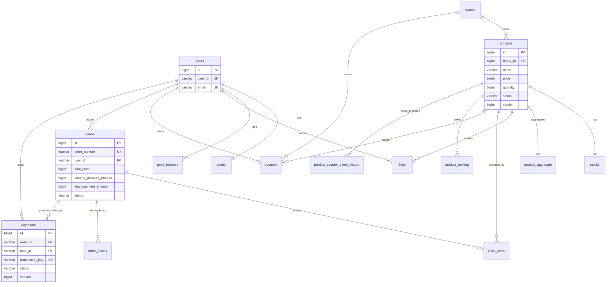

# ERD (Entity Relationship Diagram)

> 기준: `apps/commerce-api/src/main/resources/db/schema/mysql/commerce-api-schema.sql`

## 목차

- [전체 ERD](#전체-erd)
- [핵심 관계 설명](#핵심-관계-설명)
- [테이블 상세](#테이블-상세)
  - [users](#users)
  - [points](#points)
  - [point_histories](#point_histories)
  - [brands](#brands)
  - [products](#products)
  - [product_aggregate](#product_aggregate)
  - [product_counter_event_history](#product_counter_event_history)
  - [product_ranking](#product_ranking)
  - [likes](#likes)
  - [stocks](#stocks)
  - [coupons](#coupons)
  - [orders](#orders)
  - [order_items](#order_items)
  - [order_history](#order_history)
  - [event_outbox](#event_outbox)
  - [payment_callback_history](#payment_callback_history)
  - [payments](#payments)

---

## 전체 ERD

---

## 핵심 관계 설명

- `orders`와 `order_items`, `payments`는 숫자 PK가 아니라 `order_number` 문자열을 참조키로 사용한다.
- 주문 멱등성은 `order_history(user_id, idempotency_key)` 유니크 제약으로 강제한다.
- 외부 연동 신뢰성을 위해 업무 테이블과 별도로 `event_outbox`, `payment_callback_history`, `product_counter_event_history`를 둔다.
- 상품 조회 성능/정렬을 위해 `product_aggregate(like_count, order_count, view_count)`를 분리 유지한다.

---

## 테이블 상세

### users

| 컬럼명 | 타입 | 제약조건 | 설명 |
|---|---|---|---|
| id | BIGINT | PK, AUTO_INCREMENT | 사용자 PK |
| user_id | VARCHAR(20) | UK, NOT NULL | 사용자 식별자 |
| email | VARCHAR(255) | UK, NOT NULL | 이메일 |
| birthday | VARCHAR(10) | NOT NULL | 생년월일 |
| gender | VARCHAR(20) | NOT NULL | 성별 |
| created_at | DATETIME(6) | NOT NULL | 생성시각 |
| updated_at | DATETIME(6) | NOT NULL | 수정시각 |
| deleted_at | DATETIME(6) | NULL | 소프트삭제 |

### points

| 컬럼명 | 타입 | 제약조건 | 설명 |
|---|---|---|---|
| id | BIGINT | PK, AUTO_INCREMENT | 포인트 PK |
| user_id | VARCHAR(20) | UK, FK, NOT NULL | 사용자 |
| balance | DECIMAL(19,2) | NOT NULL | 현재 잔액 |
| created_at | DATETIME(6) | NOT NULL | 생성시각 |
| updated_at | DATETIME(6) | NOT NULL | 수정시각 |
| deleted_at | DATETIME(6) | NULL | 소프트삭제 |

### point_histories

| 컬럼명 | 타입 | 제약조건 | 설명 |
|---|---|---|---|
| id | BIGINT | PK, AUTO_INCREMENT | 이력 PK |
| user_id | VARCHAR(20) | FK, NOT NULL | 사용자 |
| amount | DECIMAL(19,2) | NOT NULL | 증감 금액 |
| type | VARCHAR(20) | NOT NULL | CHARGE/USE/REFUND |
| description | VARCHAR(200) | NULL | 설명 |
| created_at | DATETIME(6) | NOT NULL | 생성시각 |
| updated_at | DATETIME(6) | NOT NULL | 수정시각 |
| deleted_at | DATETIME(6) | NULL | 소프트삭제 |

인덱스: `(user_id, created_at DESC)`

### brands

| 컬럼명 | 타입 | 제약조건 | 설명 |
|---|---|---|---|
| id | BIGINT | PK, AUTO_INCREMENT | 브랜드 PK |
| name | VARCHAR(100) | NOT NULL | 브랜드명 |
| description | VARCHAR(500) | NULL | 설명 |
| logo_url | VARCHAR(500) | NULL | 로고 URL |
| created_at | DATETIME(6) | NOT NULL | 생성시각 |
| updated_at | DATETIME(6) | NOT NULL | 수정시각 |
| deleted_at | DATETIME(6) | NULL | 소프트삭제 |

### products

| 컬럼명 | 타입 | 제약조건 | 설명 |
|---|---|---|---|
| id | BIGINT | PK, AUTO_INCREMENT | 상품 PK |
| brand_id | BIGINT | FK, NOT NULL | 브랜드 |
| name | VARCHAR(255) | NOT NULL | 상품명 |
| price | BIGINT | NOT NULL, CHECK>=0 | 가격 |
| quantity | BIGINT | NOT NULL, CHECK>=0 | 수량 |
| status | VARCHAR(20) | NOT NULL | ON_SALE/SOLD_OUT/... |
| version | BIGINT | NULL | 낙관적 버전 |
| created_at | DATETIME(6) | NOT NULL | 생성시각 |
| updated_at | DATETIME(6) | NOT NULL | 수정시각 |
| deleted_at | DATETIME(6) | NULL | 소프트삭제 |

인덱스: `brand_id`, `status`

### product_aggregate

| 컬럼명 | 타입 | 제약조건 | 설명 |
|---|---|---|---|
| id | BIGINT | PK, AUTO_INCREMENT | 집계 PK |
| product_id | BIGINT | UK, FK, NOT NULL | 상품 |
| like_count | BIGINT | NOT NULL, CHECK>=0 | 좋아요 수 |
| order_count | BIGINT | NOT NULL, CHECK>=0 | 주문 수 |
| view_count | BIGINT | NOT NULL, CHECK>=0 | 조회 수 |
| created_at | DATETIME(6) | NOT NULL | 생성시각 |
| updated_at | DATETIME(6) | NOT NULL | 수정시각 |
| deleted_at | DATETIME(6) | NULL | 소프트삭제 |

### product_counter_event_history

| 컬럼명 | 타입 | 제약조건 | 설명 |
|---|---|---|---|
| id | BIGINT | PK, AUTO_INCREMENT | 이력 PK |
| dedupe_key | VARCHAR(128) | UK, NOT NULL | 멱등 키 |
| product_id | BIGINT | NOT NULL | 상품 |
| counter_type | VARCHAR(20) | NOT NULL | LIKE/ORDER/VIEW |
| process_status | VARCHAR(20) | NOT NULL | RECEIVED/PROCESSING/COMPLETED/FAILED |
| failed_reason | VARCHAR(255) | NULL | 실패 원인 |
| processed_at | DATETIME(6) | NULL | 처리시각 |
| created_at | DATETIME(6) | NOT NULL | 생성시각 |
| updated_at | DATETIME(6) | NOT NULL | 수정시각 |
| deleted_at | DATETIME(6) | NULL | 소프트삭제 |

인덱스: `product_id`, `counter_type`, `process_status`

### product_ranking

| 컬럼명 | 타입 | 제약조건 | 설명 |
|---|---|---|---|
| id | BIGINT | PK, AUTO_INCREMENT | 랭킹 PK |
| product_id | BIGINT | FK, NOT NULL | 상품 |
| rank_type | VARCHAR(20) | NOT NULL | DAILY/WEEKLY/MONTHLY |
| rank_position | BIGINT | NOT NULL | 순위 |
| score | DOUBLE | NOT NULL | 점수 |
| rank_date | DATE | NOT NULL | 기준일 |
| created_at | DATETIME(6) | NOT NULL | 생성시각 |
| updated_at | DATETIME(6) | NOT NULL | 수정시각 |
| deleted_at | DATETIME(6) | NULL | 소프트삭제 |

### likes

| 컬럼명 | 타입 | 제약조건 | 설명 |
|---|---|---|---|
| id | BIGINT | PK, AUTO_INCREMENT | 좋아요 PK |
| user_id | VARCHAR(20) | FK, NOT NULL | 사용자 |
| product_id | BIGINT | FK, NOT NULL | 상품 |
| version | BIGINT | NULL | 낙관적 버전 |
| created_at | DATETIME(6) | NOT NULL | 생성시각 |
| updated_at | DATETIME(6) | NOT NULL | 수정시각 |
| deleted_at | DATETIME(6) | NULL | 소프트삭제 |

유니크: `(user_id, product_id)`

### stocks

| 컬럼명 | 타입 | 제약조건 | 설명 |
|---|---|---|---|
| id | BIGINT | PK, AUTO_INCREMENT | 재고 PK |
| product_id | BIGINT | UK, FK, NOT NULL | 상품 |
| quantity | BIGINT | NOT NULL, CHECK>=0 | 재고 수량 |
| created_at | DATETIME(6) | NOT NULL | 생성시각 |
| updated_at | DATETIME(6) | NOT NULL | 수정시각 |
| deleted_at | DATETIME(6) | NULL | 소프트삭제 |

### coupons

| 컬럼명 | 타입 | 제약조건 | 설명 |
|---|---|---|---|
| id | BIGINT | PK, AUTO_INCREMENT | 쿠폰 PK |
| user_id | VARCHAR(20) | FK, NOT NULL | 사용자 |
| product_id | BIGINT | FK, NOT NULL | 대상 상품 |
| brand_id | BIGINT | FK, NOT NULL | 대상 브랜드 |
| coupon_name | VARCHAR(255) | NOT NULL | 쿠폰명 |
| discount_value | BIGINT | NOT NULL, CHECK>=0 | 할인값 |
| max_discount_amount | BIGINT | NULL, CHECK>=0 | 최대할인 |
| coupon_type | VARCHAR(20) | NOT NULL | FIXED_AMOUNT/PERCENTAGE |
| issued_at | DATETIME(6) | NOT NULL | 발급시각 |
| used_at | DATETIME(6) | NOT NULL | 사용시각 |
| expired_at | DATETIME(6) | NOT NULL | 만료시각 |
| coupon_status | VARCHAR(20) | NOT NULL | 상태 |
| version | BIGINT | NOT NULL DEFAULT 0 | 낙관적 버전 |
| created_at | DATETIME(6) | NOT NULL | 생성시각 |
| updated_at | DATETIME(6) | NOT NULL | 수정시각 |
| deleted_at | DATETIME(6) | NULL | 소프트삭제 |

체크: `PERCENTAGE` 타입일 때 `discount_value` 0~100

### orders

| 컬럼명 | 타입 | 제약조건 | 설명 |
|---|---|---|---|
| id | BIGINT | PK, AUTO_INCREMENT | 주문 PK |
| user_id | VARCHAR(20) | FK, NOT NULL | 사용자 |
| total_price | BIGINT | NOT NULL, CHECK>=0 | 총액 |
| coupon_discount_amount | BIGINT | NOT NULL, CHECK>=0 | 쿠폰할인 |
| final_payment_amount | BIGINT | NOT NULL, CHECK>=0 | 최종결제액 |
| order_number | VARCHAR(50) | UK, NOT NULL | 주문번호 |
| status | VARCHAR(20) | NOT NULL | PENDING/CONFIRMED/... |
| created_at | DATETIME(6) | NOT NULL | 생성시각 |
| updated_at | DATETIME(6) | NOT NULL | 수정시각 |
| deleted_at | DATETIME(6) | NULL | 소프트삭제 |

인덱스: `(user_id, created_at DESC)`, `status`

### order_items

| 컬럼명 | 타입 | 제약조건 | 설명 |
|---|---|---|---|
| id | BIGINT | PK, AUTO_INCREMENT | 주문항목 PK |
| order_id | VARCHAR(50) | FK, NOT NULL | 주문번호(orders.order_number) |
| product_id | BIGINT | FK, NOT NULL | 상품 |
| quantity | BIGINT | NOT NULL, CHECK>=0 | 수량 |
| price | BIGINT | NOT NULL, CHECK>=0 | 주문시점 단가 |
| created_at | DATETIME(6) | NOT NULL | 생성시각 |
| updated_at | DATETIME(6) | NOT NULL | 수정시각 |
| deleted_at | DATETIME(6) | NULL | 소프트삭제 |

### order_history

| 컬럼명 | 타입 | 제약조건 | 설명 |
|---|---|---|---|
| id | BIGINT | PK, AUTO_INCREMENT | 이력 PK |
| user_id | VARCHAR(20) | FK, NOT NULL | 사용자 |
| idempotency_key | VARCHAR(100) | NOT NULL | 멱등 키 |
| order_id | VARCHAR(50) | FK, NULL | 완료 주문번호 |
| created_at | DATETIME(6) | NOT NULL | 생성시각 |
| updated_at | DATETIME(6) | NOT NULL | 수정시각 |
| deleted_at | DATETIME(6) | NULL | 소프트삭제 |

유니크: `(user_id, idempotency_key)`

### event_outbox

| 컬럼명 | 타입 | 제약조건 | 설명 |
|---|---|---|---|
| id | BIGINT | PK, AUTO_INCREMENT | outbox PK |
| event_type | VARCHAR(50) | NOT NULL | 이벤트 타입 |
| aggregate_id | VARCHAR(100) | NOT NULL | aggregate 식별자 |
| dedupe_key | VARCHAR(150) | UK, NOT NULL | 멱등 키 |
| payload | LONGTEXT | NOT NULL | 직렬화 payload |
| status | VARCHAR(20) | NOT NULL | PENDING/PROCESSING/COMPLETED/FAILED |
| retry_count | INT | NOT NULL DEFAULT 0 | 재시도 횟수 |
| next_retry_at | DATETIME(6) | NOT NULL | 다음 재시도 시각 |
| last_error | VARCHAR(500) | NULL | 마지막 에러 |
| created_at | DATETIME(6) | NOT NULL | 생성시각 |
| updated_at | DATETIME(6) | NOT NULL | 수정시각 |
| deleted_at | DATETIME(6) | NULL | 소프트삭제 |

인덱스: `(status, next_retry_at)`, `(event_type, created_at)`

### payment_callback_history

| 컬럼명 | 타입 | 제약조건 | 설명 |
|---|---|---|---|
| id | BIGINT | PK, AUTO_INCREMENT | 이력 PK |
| dedupe_key | VARCHAR(128) | UK, NOT NULL | 멱등 키 |
| transaction_key | VARCHAR(255) | NULL | 거래키 |
| order_id | VARCHAR(50) | NULL | 주문번호 |
| callback_status | VARCHAR(20) | NULL | 콜백 상태 |
| process_status | VARCHAR(20) | NOT NULL | RECEIVED/PROCESSING/COMPLETED/FAILED |
| failed_reason | VARCHAR(255) | NULL | 실패 이유 |
| processed_at | DATETIME(6) | NULL | 처리시각 |
| created_at | DATETIME(6) | NOT NULL | 생성시각 |
| updated_at | DATETIME(6) | NOT NULL | 수정시각 |
| deleted_at | DATETIME(6) | NULL | 소프트삭제 |

### payments

| 컬럼명 | 타입 | 제약조건 | 설명 |
|---|---|---|---|
| id | BIGINT | PK, AUTO_INCREMENT | 결제 PK |
| order_id | VARCHAR(50) | FK, NOT NULL | 주문번호 |
| user_id | VARCHAR(20) | FK, NOT NULL | 사용자 |
| card_type | VARCHAR(20) | NOT NULL | 카드사 타입 |
| card_no | VARCHAR(19) | NOT NULL | 카드번호 |
| price | BIGINT | NOT NULL, CHECK>=0 | 결제금액 |
| callback_url | VARCHAR(500) | NOT NULL | 콜백 URL |
| transaction_key | VARCHAR(255) | UK, NULL | 거래키 |
| status | VARCHAR(20) | NOT NULL | INITIAL/PENDING/SUCCESS/FAILED |
| reason | VARCHAR(255) | NOT NULL | 상태 설명 |
| version | BIGINT | NOT NULL DEFAULT 0 | 낙관적 버전 |
| created_at | DATETIME(6) | NOT NULL | 생성시각 |
| updated_at | DATETIME(6) | NOT NULL | 수정시각 |
| deleted_at | DATETIME(6) | NULL | 소프트삭제 |

---

## 운영 관점 체크포인트

- 주문 중복 제어: `order_history` 유니크 키 + 애플리케이션 claim 로직
- 콜백 중복 제어: `payment_callback_history.dedupe_key`
- 이벤트 중복 제어: `event_outbox.dedupe_key`, `product_counter_event_history.dedupe_key`
- 읽기모델 보정: `product_aggregate`는 이벤트 처리 + 리컨실 스케줄러 병행
